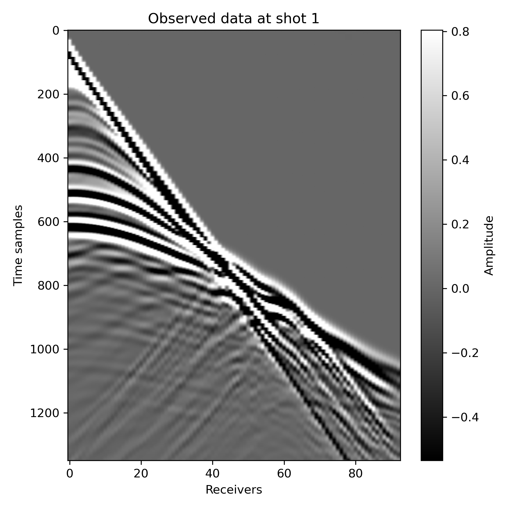

# Full Waveform Inversion on the Marmousi Model with Deepwave (PyTorch)

This repository contains a single Jupyter notebook implementing **2-D acoustic Full Waveform Inversion (FWI)** on the **Marmousi velocity model** using **Deepwave** and **PyTorch automatic differentiation**. It documents a **reproducible FWI experiment** (not a general-purpose inversion framework): forward modeling → inversion → diagnostics and error metrics.

The notebook demonstrates how differentiable wave propagation can be used to perform gradient-based seismic inversion.

---

## Contents

| File | Description |
|------|------------|
| [`fwi_marmousi_deepwave.ipynb`](fwi_marmousi_deepwave.ipynb) | Notebook: Marmousi preprocessing, forward modelling, FWI, plots + diagnostics |
| `.gitignore` | Git configuration file |
|`environment.cpu.yml`|Conda environment for CPU execution|
|`environment.gpu.yml`|Conda environment for NVIDIA GPU (CUDA) execution|
| `observed_data_shot_1.png` | Example figure (observed data, shot 1) |
| `result_fwi_marmousi.png` | Example figure (FWI result) |
| `all_data.png` | Figure of the observed data, the predicted data and the resiudal |

The repository is intentionally minimal (code + environments + small example figures).
No large datasets stored.

---

## What the notebook does

In `fwi_marmousi_deepwave.ipynb`, the workflow is:

1. Load the Marmousi P-wave velocity model from a local binary `.bin` file.
2. Smooth + subsample the model to reduce computational cost.
3. Define acquisition geometry (shots/receivers) and a Ricker source wavelet.
4. Generate synthetic “observed” data via forward modeling with Deepwave.
5. Run FWI with Adam optimiser **and a learning-rate schedule**.
6. Plot inversion progress and final results.
7. Compute **shot-by-shot data misfit metrics** and plot **observed vs predicted vs residual** for selected shots.

Gradients are obtained via **PyTorch autograd** through the Deepwave propagator.

---

## Requirements and environment setup

The full computational environment is provided via Conda for both CPU and GPU execution.

### CPU:
```bash
conda env create -f environment.cpu.yml
conda activate fwi-marmousi-deepwave-cpu
```

### GPU (NVIDIA):
```bash
conda env create -f environment.gpu.yml  
conda activate fwi-marmousi-deepwave-gpu
```

## Marmousi model input (required)
The notebook expects a **Marmousi P-wave velocity** file in **raw binary `.bin`** format (Vp, in m/s), e.g. from the GeoAzur WIND database:

https://www.geoazur.fr/WIND/bin/view/Main/Data/Marmousi

Place the file where the notebook expects it (see the model-loading cell), or edit the path variable in the notebook accordingly.

Note: the notebook assumes a specific array shape/dtype when reading the file (as defined in the loading cell). If your .bin differs (shape, dtype), update those parameters in the notebook.

---

## Reproducibility check

This repository was tested from a clean clone on **WSL2 Ubuntu 24.04** using the provided CPU environment file.


```bash
git clone https://github.com/louise-nsangou/fwi-marmousi-deepwave
cd fwi-marmousi-deepwave
conda env create -f environment.cpu.yml
conda activate fwi-marmousi-deepwave-cpu
python -c "import torch, deepwave, numpy, scipy, matplotlib, skimage; print('Imports OK')"
jupyter lab
```

If `conda env create` fails with a transient network error (e.g., `IncompleteRead`), retrying the same command usually resolves it.


---

## Example outputs

| **Observed data** | **FWI result** |
|-------------------|-----------------|
|  |  |


---

## Scientific context

Full Waveform Inversion is a PDE-constrained optimization problem in which subsurface parameters are recovered by minimizing the misfit between observed and simulated seismic data.

This notebook uses Deepwave (differentiable wave propagation library) + PyTorch autograd to compute gradients, rather than the classical adjoint-state method.

---

## Limitations

- The Marmousi velocity model is **not** included in this repository and must be provided by the user.
- The notebook generates results interactively; only small example figures are stored in the repo.

---

## References

Richardson, A. (Deepwave). Zenodo. https://doi.org/10.5281/zenodo.3829886

Virieux, J., & Operto, S. (2009).  
An overview of full-waveform inversion in exploration geophysics.  
*Geophysics*, 74(6), WCC1–WCC26.

Marmousi velocity model (dataset).  
GeoAzur WIND database. Retrieved January 12, 2026, from  
https://www.geoazur.fr/WIND/bin/view/Main/Data/Marmousi

---

## Author

**Louise-M. Nsangou**  
MSc Exploration & Applied Geophysics  
University of Pisa & Montanuniversität Leoben

---

## Acknowledgements

I would like to thank **Prof. Nicola Bienati**, **Dr. Sean Berti**, and **Felipe Rincón** for helpful discussions, guidance, and support during the development of this project.

---

## How to cite this repository

If you use this notebook (code, figures, or results) in academic work, please cite it as:

**Nsangou, L.-M.** (2026). *Full Waveform Inversion on the Marmousi Model with Deepwave (PyTorch)*.  
GitHub repository: https://github.com/louise-nsangou/fwi-marmousi-deepwave

### BibTeX
```bibtex
@misc{nsangou2026fwi,
  author       = {Nsangou, Louise-Marietta},
  title        = {Full Waveform Inversion on the Marmousi Model with Deepwave (PyTorch)},
  year         = {2026},
  howpublished = {\url{https://github.com/louise-nsangou/fwi-marmousi-deepwave}},
  note         = {Jupyter notebook implementing acoustic FWI on the Marmousi model using Deepwave and PyTorch}
}
```
