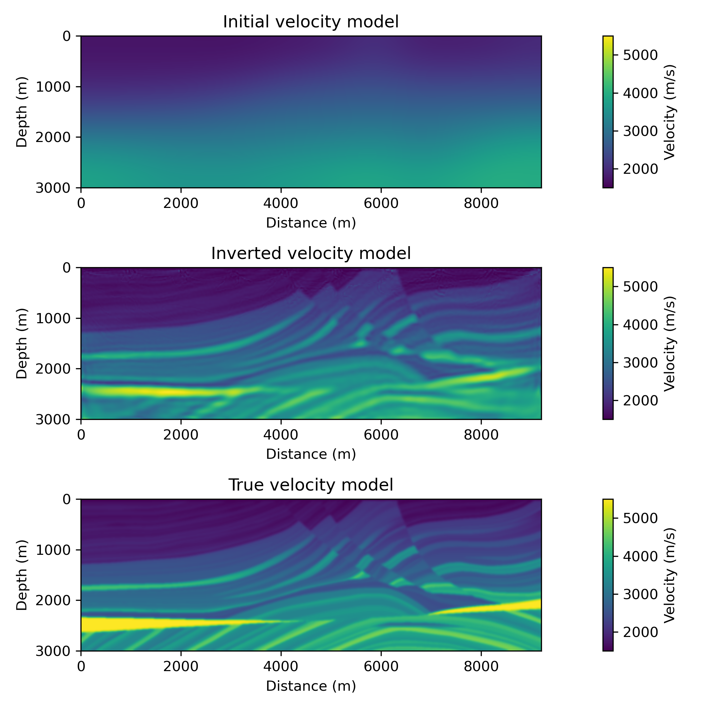

# Full Waveform Inversion on the Marmousi Model with Deepwave (PyTorch)

This repository contains a single Jupyter notebook implementing **2-D acoustic Full Waveform Inversion (FWI)** on the **Marmousi velocity model** using **Deepwave** and **PyTorch automatic differentiation**. It documents a reproducible FWI experiment rather than a general-purpose inversion framework.

The notebook demonstrates how differentiable wave propagation can be used to perform gradient-based seismic inversion.

---

## What is inside

| File | Description |
|------|------------|
| [`fwi_marmousi_deepwave.ipynb`](fwi_marmousi_deepwave.ipynb) | Main notebook performing forward modelling and FWI on the Marmousi model |
| `.gitignore` | Git configuration file |
|`environment.cpu.yml`|Conda environment for running the notebook on CPU-only systems|
|`environment.gpu.yml`|Conda environment for running the notebook on NVIDIA GPUs with CUDA support|

No large datasets are stored in the repository; wavefields and seismograms are generated by the notebook.

---

## What the notebook does

Workflow implemented in `fwi_marmousi_deepwave.ipynb`:

1. Load the Marmousi P-wave velocity model.
2. Define a 2-D acoustic wave equation using Deepwave.
3. Define source and receiver geometry for a seismic acquisition.
4. Simulate synthetic seismic data (forward modelling).
5. Perform iterative Full Waveform Inversion using PyTorch automatic differentiation.
6. Visualise the evolution of the velocity model and data misfit.

The gradient of the misfit is computed through PyTorch’s automatic differentiation applied to the Deepwave propagator.

---

## How to run

### Environment
**CPU**:
conda env create -f environment.cpu.yml  
conda activate fwi-marmousi-deepwave-cpu  

**GPU (NVIDIA)**:
conda env create -f environment.gpu.yml  
conda activate fwi-marmousi-deepwave-gpu

1. Install the required Python packages:
   - `torch`
   - `deepwave`
   - `numpy`
   - `scipy`
   - `matplotlib`
   - `scikit-image`
   - `jupyterlab` or `notebook`

2. Open the notebook:
   - `fwi_marmousi_deepwave.ipynb`

3. Run all cells in order.

---

## Example outputs




---

## Scientific context

Full Waveform Inversion is a PDE-constrained optimization problem in which subsurface parameters are recovered by minimizing the misfit between observed and simulated seismic data.

This notebook uses Deepwave, a differentiable wave-propagation library built on PyTorch, to compute gradients through automatic differentiation rather than the classical adjoint-state method.

---

## Limitations

The repository does not include:
- The Marmousi velocity model. It is loaded from a local file path and must be provided by the user (e.g., from the GeoAzur WIND database: https://www.geoazur.fr/WIND/bin/view/Main/Data/Marmousi, or from SEG or institutional mirrors).
- Saved inversion results (only figures generated in the notebook).

Therefore, exact reproducibility depends on the local software environment and data availability.

---

## References

Deepwave (PyTorch wave propagation and automatic differentiation):  
https://ausargeo.com/deepwave/pytorch

Virieux, J., & Operto, S. (2009).  
An overview of full-waveform inversion in exploration geophysics.  
*Geophysics*, 74(6), WCC1–WCC26.

Marmousi velocity model (dataset).  
GeoAzur WIND database. Retrieved January 12, 2026, from  
https://www.geoazur.fr/WIND/bin/view/Main/Data/Marmousi

---

## Author

Louise-M. Nsangou  
MSc Exploration & Applied Geophysics  
University of Pisa & Montanuniversität Leoben

---

## Acknowledgements

I would like to thank **Dr. Sean Berti** and **Prof. Nicola Bienati** for helpful discussions, guidance, and support during the development of this project.

---

## How to cite this repository

If you use this notebook (code, figures, or results) in academic work, please cite it as:

**Nsangou, L.-M.** (2026). *Full Waveform Inversion on the Marmousi Model with Deepwave (PyTorch)*.  
GitHub repository: https://github.com/louise-nsangou/fwi-marmousi-deepwave

### BibTeX
```bibtex
@misc{nsangou2026fwi,
  author       = {Nsangou, Louise-Marietta},
  title        = {Full Waveform Inversion on the Marmousi Model with Deepwave (PyTorch)},
  year         = {2026},
  howpublished = {\url{https://github.com/louise-nsangou/fwi-marmousi-deepwave}},
  note         = {Jupyter notebook implementing acoustic FWI on the Marmousi model using Deepwave and PyTorch}
}

